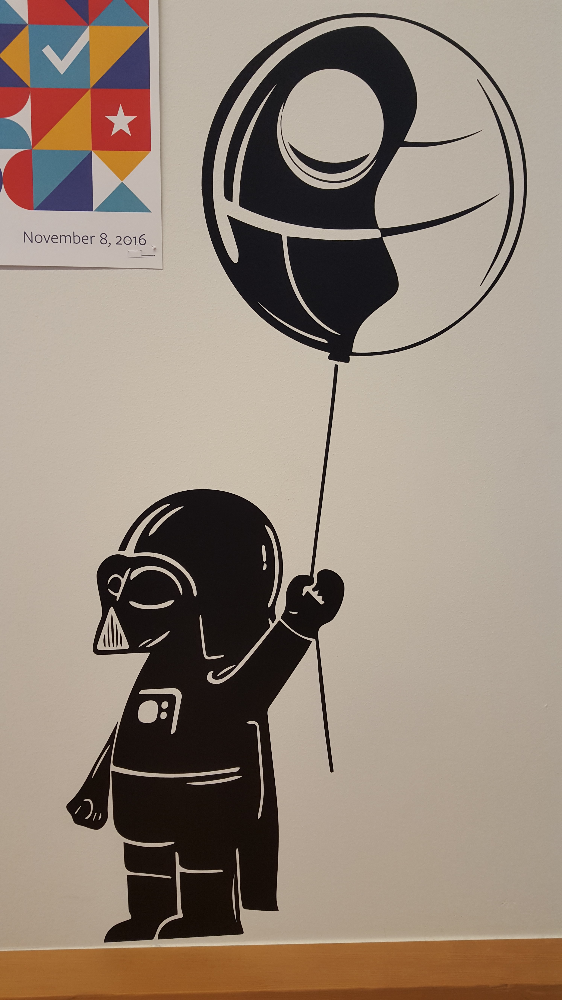

# Darth Vader Balloon

On a work trip in 2016 to Menlo Park, CA, I saw this poster on the wall. 

Whimsical and fun - I really liked the image.  When I got home from the trip I looked online for a source file that I could buy.  I couldn't find it anywhere although the image appears on many different types of products - I found it on Tshirts, stickers, mugs, etc - and from many many sellers.  Either everyone is violating Disney's copywrite ownership or it isn't captured by copywrite laws.  

I drew the vectors and then cut this out from heavy black card stock.  It came out pretty similar to the original image (shown above).  Of course I had to make some changes in order to enable the image to be a single continous cut and avoid interior pieces being completely cut out.  I think my changes make the original look better, but I'm probably biased. 

Sharing the vector file in case others also have children who would like a similar image for their bedroom wall or laser etched on their laptops.  :)
